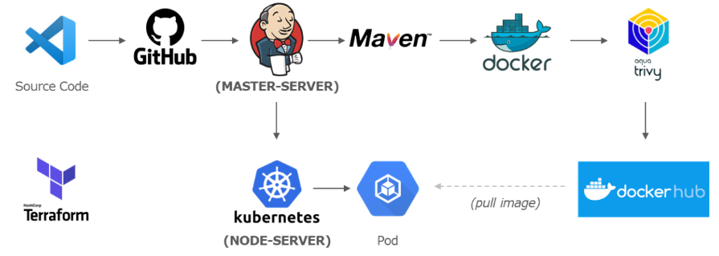

# Devops-Project.

This repository contains the following components:

1.  Simple Java Code
2.  Dockerfile
3.  Kubernetes manifests (`deployment.yaml` & `service.yaml`)
4.  Jenkinsfile (CI & CD)
5.  Terraform code

## Algorithm

#### 1.  Create two EC2 instances: 'Master-Server' & 'Node-Server' using Terraform

    a. 'Master-Server' will have Java, Jenkins, Maven, Docker, Ansible, & Trivy packages
    b. 'Node-Server' will have Docker, Kubeadm & Kubernetes packages

#### 2.  Establish passwordless connection between 'Master-Server' & 'Node-Server'
     <Commands to run in 'Node-Server'>
     sudo su -
     passwd ec2-user                         # (set password)
     vi /etc/ssh/sshd_config                 # (Allow 'PermitRootLogin yes' & allow 'PasswordAuthentication yes')
     service sshd restart

     <Commands to run in 'Master-Server'>
     ssh-keygen                              # (this will generate ssh key, press enter when prompted)
     ssh-copy-id ec2-user@<Node_Private_IP>  # (enter 'yes' when prompted & enter the Node's ec2-user password when prompted)

#### 3.  Access Jenkins portal & add credentials in Jenkins portal as below:
     (Manage Jenkins --> Credentials --> System --> Global credentials)

    a. Dockerhub credentials - username & password (Use 'secret text' & save them separately)
    b. K8s server username with private key (Use 'SSH Username with private key')
    c. Add Github username & token (Generate Github token & save as 'secret key' in Jenkins server)
        (Github: Github settings --> Developer settings --> Personal Token classic --> Generate)
    d. Dockerhub token (optional) (Generate token & save as 'secret key')
        (Dockerhub: Account --> Settings --> Security --> Generate token & copy it)

#### 4.  Add required plugins in Jenkins portal
     (Manage Jenkins --> Plugins --> Available plugins --> 'ssh agent' --> Install)
     (This plugin is required to generate ssh agent syntax using pipeline syntax generator)

#### 5.  Access Jenkins portal & paste the 'CI-pipeline' code
     Run the pipeline

#### 6.  Now create another 'CD-pipeline'
     a. Enter the 'Pipeline name', 'Project Name' & 'Node-Server' Private IP under the environment variables section
     b. Run the pipeline
     c. Access the content from the browser using <Node_Server_Public_IP>:<NodePort_No>

#### 7.  Automation
     a. Automate the CD pipeline after CI pipeline is built successfully
        (CD-pipeline --> Configure --> Build Triggers --> Projects to watch (CI-pipeline) --> 
        Trigger only if build is stable --> Save)
     b. Automate CI pipeline if any changes are pushed to Github
        (Webhook will be created in Github & trigger will be created in Jenkins)
        Jenkins --> Configure --> Build triggers --> 'Github hook trigger for GitSCM polling' --> Save
        Jenkins --> <Your_Account> --> Configure --> API Tokens --> <Jenkins-API-Token>
        Github --> <Your-Repo> --> Settings --> Webhooks --> "<Jenkins-url>:8080/github-webhook/"; -->
        Content type: json;     Secret: <Jenkins-API-Token> --> Add Webhook
        (Try making any changes in your code & the pipeline should automatically trigger)

#### 8.  Deletion
     a. Run the below command in Terraform to destroy the entire infrastructure
        terraform destroy --auto-approve
